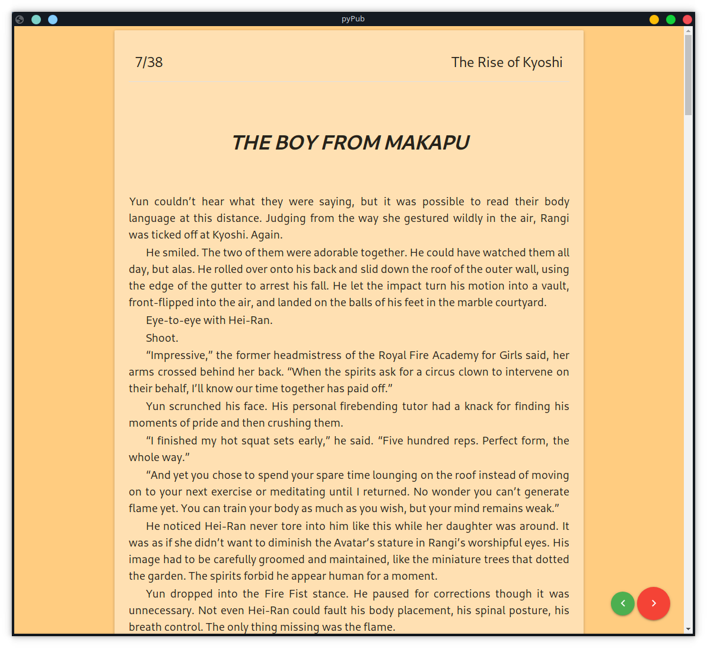

# pyPub

A not so small epub ebook reader made with flaskGUI (a discount python based electron). It automaticly saves your reading 
progress in `~/.pyPub.json` every time you scroll.



> This program requires that you have google-chrome or chromium installed, it may work with other browsers.

# Instalation:

#TODO pypi

# Usage:

#TODO pypi

If you want to use just run the flask portion to read ebooks in your browser then you can run entrypointDebug.py like so:

```
python entrypointDebug.py <path to epub file>
```

And than you can browse to [localhost:5000](http://localhost:5000) in order to read your ebook.

# Known issues:

- flask seems to die when changing chapters rapidly.